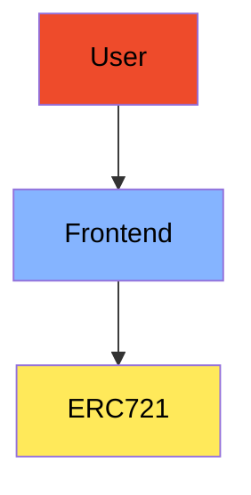
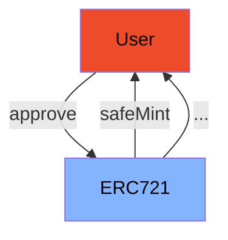

<div align="center">
    
</div>
<br>
<div align="center">
    <i>NFT Class</i>
</div>
<div align="center">
This repository aims to have an NFT contract to demonstrate how Non-fungible tokens work.
</div>
<br>
<div align="center">
    
  <a href="">[](https://book.getfoundry.sh/getting-started/installation)</a>
</div>

# Contracts X Tokens

Smart contracts are capable of creating, managing, and transferring NFTs, providing a direct relationship between the contract and the digital assets it creates. Additionally, transactions involving the transfer of ownership of an NFT are recorded on the blockchain, allowing for the identification of the contract associated with the NFT in question. Events emitted by smart contracts, such as NFT creation or transfer, also offer insights into this correlation. Additionally, NFT metadata may contain information referencing the contract responsible for its creation, enabling a more in-depth analysis of this relationship between contracts and NFTs.

> [!IMPORTANT]
> To interact with this project snippet, it is necessary to install Foundry, a toolkit for Ethereum application development, follow the instructions provided [here](https://getfoundry.sh/). Additionally, it is necessary to have the "make" binary configured on your machine. Disclaimer: all actions described here were performed on an Ubuntu-based distribution.

## 1. General Architechture:
### - Application X Contract:




## 2. User X Contracts:

### - Interacting w/ ERC721:



## 3. How to run:

To deploy these contracts on testnets, follow the commands below.

#### Generate the `.env` file and install the project dependencies contained in the `.gitmodules` file:

```bash
make setup
```

#### Execute the tests:
```bash
make test
```

> [!IMPORTANT]
> Before running the command below, confirm that the `.env` file contains all the necessary variables for deployment.

#### Deploy the contracts:
```bash
make deploy
```
